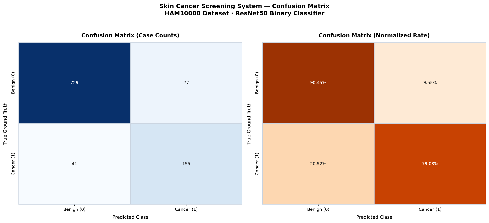

# Skin Cancer Screening & Classification System
## ระบบคัดกรองและวิเคราะห์มะเร็งผิวหนัง — Clinical Decision Support Tool

ระบบ AI สำหรับคัดกรองมะเร็งผิวหนังแบบ **Binary Classification** (Cancer vs Non-Cancer) จาก HAM10000 Dataset โดยใช้ Deep Learning (ResNet50 Transfer Learning)

> [!IMPORTANT]
> ระบบ AI นี้เป็นเครื่องมือสนับสนุนการคัดกรองเบื้องต้นทางวิชาการและการวิจัยทางการแพทย์เท่านั้น ไม่สามารถใช้ทดแทนการวินิจฉัยจากแพทย์ผิวหนังเฉพาะทางได้

---

## สารบัญ

- [1. ภาพรวมโปรเจค](#1-ภาพรวมโปรเจค)
- [2. คุณสมบัติหลัก](#2-คุณสมบัติหลัก)
- [3. โครงสร้างโปรเจค](#3-โครงสร้างโปรเจค)
- [4. Dataset: HAM10000](#4-dataset-ham10000)
- [5. เทคโนโลยีและไลบรารีที่ใช้](#5-เทคโนโลยีและไลบรารีที่ใช้)
- [6. สถาปัตยกรรมโมเดล](#6-สถาปัตยกรรมโมเดล)
- [7. Pipeline การทำงาน](#7-pipeline-การทำงาน)
- [8. รายละเอียดแต่ละ Step](#8-รายละเอียดแต่ละ-step)
- [9. เทคนิค AI/ML ที่ใช้](#9-เทคนิค-aiml-ที่ใช้)
- [10. การติดตั้งและวิธีใช้งาน](#10-การติดตั้งและวิธีใช้งาน)
- [11. การตั้งค่าเฉพาะทาง](#11-การตั้งค่าเฉพาะทาง)
- [12. ผลการทดสอบ](#12-ผลการทดสอบ)
- [13. จุดเด่นและข้อจำกัด](#13-จุดเด่นและข้อจำกัด)
- [14. สรุป](#14-สรุป)

---

## 1. ภาพรวมโปรเจค

โปรเจคนี้เป็น **ระบบ AI สำหรับคัดกรองมะเร็งผิวหนัง (Skin Cancer Screening System)** ที่จำแนกรอยโรคผิวหนังออกเป็น **2 กลุ่ม** แบบ Binary Classification:

| Class | กลุ่ม | รอยโรคที่รวม |
|-------|------|-------------|
| **Class 1** | Cancer / Pre-Cancer (Malignant) | mel (Melanoma), bcc (Basal Cell Carcinoma), akiec (Actinic Keratoses) |
| **Class 0** | Non-Cancer (Benign) | nv (Melanocytic Nevi), bkl (Benign Keratosis), vasc (Vascular Lesion), df (Dermatofibroma) |

โดยใช้เทคนิค **Transfer Learning** จากโมเดล **ResNet50** ที่ถูก pre-train มาจาก ImageNet พัฒนาเป็นส่วนหนึ่งของวิชา **CPE310 — Healthcare AI System**

> [!NOTE]
> เวอร์ชันปัจจุบันเปลี่ยนจากการจำแนก 7 คลาส (Multi-class) เป็น **Binary Classification** ที่เน้นคัดกรอง Cancer vs Non-Cancer เพื่อให้ตรงกับบริบทการใช้งานทางคลินิก (Clinical Screening)

---

## 2. คุณสมบัติหลัก

| Feature | รายละเอียด |
|---------|-----------|
| **Binary Cancer Screening** | จำแนก Cancer/Pre-Cancer vs Non-Cancer (Benign) |
| **Transfer Learning** | ResNet50 pre-trained on ImageNet V2 |
| **Apple Silicon GPU** | รองรับ MPS (Metal Performance Shaders) Acceleration |
| **Data Augmentation** | Flip, Rotation, ColorJitter, Affine (6 เทคนิค) |
| **Class Balancing** | Weighted CrossEntropy Loss แก้ปัญหา Data Imbalance |
| **Early Stopping** | Patience = 3 epochs ตาม Val F1-Score |
| **LR Scheduling** | ReduceLROnPlateau ลด Learning Rate อัตโนมัติ |
| **Clinical Metrics** | Sensitivity, Specificity, PPV, NPV, FNR |
| **Professional Web UI** | Gradio interface ออกแบบเชิงคลินิก (ไม่ใช้ Emoji) |
| **Risk Assessment** | HIGH RISK / LOW RISK พร้อมคำแนะนำทางคลินิก |

---

## 3. โครงสร้างโปรเจค

```
Healthcare AI System/
├── Dataset/
│   ├── HAM10000_images_part_1/        # รูปภาพชุดที่ 1 (~5,000 ภาพ)
│   ├── HAM10000_images_part_2/        # รูปภาพชุดที่ 2 (~5,015 ภาพ)
│   ├── HAM10000_metadata.csv          # Metadata: image_id, dx, ... (563 KB)
│   ├── hmnist_28_28_L.csv             # Grayscale 28×28 pixel data
│   ├── hmnist_28_28_RGB.csv           # RGB 28×28 pixel data
│   ├── hmnist_8_8_L.csv              # Grayscale 8×8 pixel data
│   └── hmnist_8_8_RGB.csv            # RGB 8×8 pixel data
├── skin_lesion_classifier.py          # สคริปต์หลัก (1,358 บรรทัด, ~56 KB)
├── best_cancer_model.pth              # โมเดล Binary ที่เทรนแล้ว (~227 MB)
├── best_skin_model.pth                # โมเดล 7-class เวอร์ชันเก่า (~227 MB)
├── cancer_confusion_matrix.png        # Confusion Matrix ของ Binary Model
├── confusion_matrix.png               # Confusion Matrix ของ 7-class Model (เก่า)
├── requirements.txt                   # Dependencies
├── README.md                          # ไฟล์นี้
└── venv/                              # Python Virtual Environment
```

---

## 4. Dataset: HAM10000

**HAM10000** (Human Against Machine with 10000 training images) เป็นชุดข้อมูลมาตรฐานทางการแพทย์สำหรับวิจัยด้าน dermatoscopy ประกอบด้วย:

- **จำนวนภาพ:** ~10,015 ภาพ (แบ่งเป็น 2 โฟลเดอร์)
- **ขนาดภาพ:** ภาพ dermatoscopic คุณภาพสูง
- **Metadata:** ไฟล์ CSV ที่มีข้อมูล `image_id`, `dx` (diagnosis) และข้อมูลอื่นๆ

### การจัดกลุ่มรอยโรค (Binary Grouping)

#### Class 1: Cancer & Pre-Cancer (Malignant) — เป้าหมายการคัดกรอง

| รหัส | ชื่อภาษาอังกฤษ | ชื่อภาษาไทย | ระดับเสี่ยง |
|------|---------------|------------|------------|
| `mel` | Melanoma | มะเร็งผิวหนังเมลาโนมา | สูงมาก |
| `bcc` | Basal Cell Carcinoma | มะเร็งเซลล์ฐาน | สูง |
| `akiec` | Actinic Keratoses / Bowen's Disease | ผิวหนังก่อนมะเร็ง | ปานกลาง (Precancerous) |

#### Class 0: Non-Cancer (Benign) — รอยโรคไม่ร้ายแรง

| รหัส | ชื่อภาษาอังกฤษ | ชื่อภาษาไทย | ระดับเสี่ยง |
|------|---------------|------------|------------|
| `nv` | Melanocytic Nevi | ไฝ / ขี้แมลงวัน | ต่ำ |
| `bkl` | Benign Keratosis-like Lesion | รอยโรคสะเก็ดไม่ร้ายแรง | ต่ำ |
| `vasc` | Vascular Lesion | รอยโรคหลอดเลือด | ต่ำ |
| `df` | Dermatofibroma | เนื้องอกเส้นใยผิวหนัง | ต่ำ |

> [!NOTE]
> Dataset นี้มีปัญหา **Class Imbalance** — กลุ่ม Benign (~80%) มีมากกว่า Cancer (~20%) อย่างมาก โปรเจคแก้ปัญหานี้ด้วย Weighted CrossEntropy Loss

---

## 5. เทคโนโลยีและไลบรารีที่ใช้

### 5.1 Core Deep Learning

| Library | Version | หน้าที่ |
|---------|---------|--------|
| **PyTorch** | ≥ 2.0.0 | Framework หลักสำหรับ Deep Learning |
| **TorchVision** | ≥ 0.15.0 | Pre-trained models (ResNet50), transforms |

### 5.2 Data Processing

| Library | Version | หน้าที่ |
|---------|---------|--------|
| **Pandas** | ≥ 2.0.0 | อ่านและจัดการ CSV metadata |
| **NumPy** | ≥ 1.24.0 | การคำนวณเชิงตัวเลข |
| **Pillow (PIL)** | ≥ 9.5.0 | โหลดและแปลงรูปภาพ |
| **scikit-learn** | ≥ 1.3.0 | แบ่งข้อมูล, metrics, class weights |

### 5.3 Visualization & UI

| Library | Version | หน้าที่ |
|---------|---------|--------|
| **Matplotlib** | ≥ 3.7.0 | พล็อต Confusion Matrix |
| **Seaborn** | ≥ 0.12.0 | Heatmap สำหรับ Confusion Matrix |
| **tqdm** | ≥ 4.65.0 | Progress bar ขณะเทรน |
| **Gradio** | ≥ 4.0.0 | Web demo interface (Clinical UI) |

### 5.4 Hardware Acceleration

- **Apple Silicon MPS** (Metal Performance Shaders) — ออกแบบมาสำหรับ macOS โดยเฉพาะ
- รองรับ **CUDA** (NVIDIA GPU) เช่นกัน
- Fallback เป็น **CPU** หากไม่มี GPU

---

## 6. สถาปัตยกรรมโมเดล

### 6.1 Transfer Learning ด้วย ResNet50 (Binary Output)

โปรเจคนี้ใช้เทคนิค **Transfer Learning** โดยนำโมเดล **ResNet50** ที่ถูก pre-train บน **ImageNet (V2)** มาดัดแปลงสำหรับ Binary Classification:

```
📷 Input Image (224 × 224 × 3)
        │
        ▼
┌─────────────────────────────────────────┐
│         ResNet50 Backbone               │
│         (Pre-trained on ImageNet)       │
│                                         │
│  Frozen Layers (ไม่เทรนซ้ำ):            │
│     ├── conv1 + bn1                     │
│     ├── layer1                          │
│     ├── layer2                          │
│     └── layer3                          │
│                                         │
│  Trainable Layer (Fine-tuning):         │
│     └── layer4                          │
└─────────────────────┬───────────────────┘
                      │
                      ▼
┌─────────────────────────────────────────┐
│      Custom Classifier Head             │
│                                         │
│  Linear(2048 → 512)                     │
│       ▼                                 │
│  ReLU Activation                        │
│       ▼                                 │
│  BatchNorm1d(512)                       │
│       ▼                                 │
│  Dropout(p=0.3)                         │
│       ▼                                 │
│  Linear(512 → 2)  ← Binary Output      │
└─────────────────────┬───────────────────┘
                      │
                      ▼
        Output: 2 Classes
        [0] Non-Cancer  [1] Cancer
```

### 6.2 Freezing Strategy

| Layer | Trainable? | รายละเอียด |
|-------|-----------|-----------|
| `conv1`, `bn1` | Frozen | เรียนรู้ low-level features (edges, textures) |
| `layer1` | Frozen | เรียนรู้ basic patterns |
| `layer2` | Frozen | เรียนรู้ mid-level features |
| `layer3` | Frozen | เรียนรู้ complex patterns |
| **`layer4`** | **Trainable** | **Fine-tune high-level features สำหรับ skin lesion** |
| **Custom FC Head** | **Trainable** | **Binary classifier: Cancer vs Non-Cancer** |

- **Parameters ทั้งหมด:** ~23.5 ล้าน
- **Parameters ที่เทรนได้:** ~16 ล้าน (layer4 + FC head)
- **Parameters ที่ Freeze:** ~8.5 ล้าน

> [!TIP]
> การ freeze layer ต้นๆ ช่วยรักษา feature extraction ทั่วไป (edges, textures) จาก ImageNet ในขณะที่ fine-tune layer หลังๆ ให้เรียนรู้ features เฉพาะทาง (skin lesion patterns) ทำให้เทรนได้เร็วและใช้ข้อมูลน้อยลง

---

## 7. Pipeline การทำงาน

```
Step 2.1                Step 2.2              Step 2.3             Step 2.4              Step 2.5
Data Preparation   →    DataLoader      →     Training       →     Evaluation      →     Demo
                        & Augmentation         & Model               & Metrics
─────────────────────────────────────────────────────────────────────────────────────────────────
• อ่าน CSV             • Train:               • ResNet50            • Classification     • Gradio UI
• สแกนรูป               Augmentation           + Custom Head          Report               (Clinical)
• Map image_id→path    • Val/Test:            • AdamW Optimizer     • Sensitivity        • Upload Image
• Binary Label           Resize+Normalize     • Weighted Loss         Specificity        • Cancer
  (Cancer vs Benign)   • DataLoader           • Early Stopping        PPV / NPV            Screening
• Stratified Split       batch=32             • LR Scheduling       • Confusion Matrix   • Risk
  80/10/10             • workers=2                                    (2×2 Binary)         Assessment
• Class Weights
```

---

## 8. รายละเอียดแต่ละ Step

### 8.1 Step 2.1: Data Preparation & Cancer-Focused Preprocessing

> โค้ด: `skin_lesion_classifier.py` บรรทัด 188–307

1. **อ่าน Metadata CSV** — อ่านไฟล์ `HAM10000_metadata.csv`
2. **สแกนรูปภาพ** — สแกนทั้ง 2 โฟลเดอร์เพื่อสร้าง mapping ระหว่าง `image_id` กับ file path
3. **แปลง Label เป็น Binary** — จัดกลุ่มรหัสโรค 7 ชนิดเป็น 2 คลาส:
   - `mel`, `bcc`, `akiec` → **Class 1 (Cancer / Pre-Cancer)**
   - `nv`, `bkl`, `vasc`, `df` → **Class 0 (Non-Cancer / Benign)**
4. **เก็บ Subtype** — เก็บรหัสโรคดั้งเดิมไว้ในคอลัมน์ `subtype` สำหรับ stratified split
5. **Stratified Split โดย Subtype** — แบ่งข้อมูลโดยรักษาอัตราส่วนของโรคทั้ง 7 ชนิดย่อยในทุก split:
   - **Train: 80%** | **Validation: 10%** | **Test: 10%**
6. **คำนวณ Class Weights** — ใช้ `compute_class_weight("balanced")` สำหรับ 2 คลาส

### 8.2 Step 2.2: Custom Dataset & Data Augmentation

> โค้ด: `skin_lesion_classifier.py` บรรทัด 310–404

#### Data Augmentation สำหรับ Training Set

| เทคนิค | Parameter | วัตถุประสงค์ |
|--------|-----------|-------------|
| `Resize` | 224 × 224 | ปรับขนาดภาพให้ตรงกับ input ของ ResNet50 |
| `RandomHorizontalFlip` | p=0.5 | พลิกภาพซ้าย-ขวาแบบสุ่ม 50% |
| `RandomVerticalFlip` | p=0.5 | พลิกภาพบน-ล่างแบบสุ่ม 50% |
| `RandomRotation` | ±180° | หมุนภาพแบบสุ่ม |
| `ColorJitter` | brightness=0.2, contrast=0.2, saturation=0.1, hue=0.05 | ปรับแสง/สีแบบสุ่ม |
| `RandomAffine` | translate=5%, scale=95–105% | เลื่อนและซูมแบบสุ่ม |
| `Normalize` | ImageNet mean/std | ปรับค่าพิกเซลตาม ImageNet |

#### Evaluation Transform (Val/Test)

- เฉพาะ `Resize(224×224)` → `ToTensor()` → `Normalize()` — **ไม่มี augmentation**

#### DataLoader Configuration

| Setting | ค่า | เหตุผล |
|---------|-----|-------|
| `batch_size` | 32 | สมดุลระหว่าง memory กับ convergence |
| `num_workers` | 2 | เหมาะกับ macOS (หลีกเลี่ยง fork crash) |
| `pin_memory` | True | เร่งการโอนข้อมูลไป GPU |
| `drop_last` | True (train เท่านั้น) | ป้องกัน batch สุดท้ายที่เล็กเกินไปกับ BatchNorm |

### 8.3 Step 2.3: Model Building & Training

> โค้ด: `skin_lesion_classifier.py` บรรทัด 407–642

#### Hyperparameters

| Parameter | ค่า | หมายเหตุ |
|-----------|-----|---------|
| Image Size | 224 × 224 | มาตรฐานของ ResNet |
| Learning Rate | 1e-4 | ค่อนข้างต่ำเพราะ fine-tune |
| Weight Decay | 1e-2 | L2 regularization |
| Epochs | 15 (max) | อาจหยุดก่อนด้วย Early Stopping |
| Early Stopping Patience | 3 epochs | หยุดหาก Val F1 ไม่ดีขึ้น 3 epoch ติดต่อกัน |
| NUM_CLASSES | **2** | Binary: Non-Cancer (0) vs Cancer (1) |

#### Optimizer: AdamW

- **AdamW** (Adam with decoupled Weight Decay)
- เทรนเฉพาะ parameters ที่ `requires_grad=True` (layer4 + FC head)

#### Loss Function: Weighted CrossEntropyLoss

- `nn.CrossEntropyLoss(weight=class_weights)` สำหรับ 2 คลาส
- คลาส Cancer (~20% ของข้อมูล) ได้รับน้ำหนักสูงขึ้นเพื่อเพิ่ม Sensitivity

#### Learning Rate Scheduler: ReduceLROnPlateau

| Setting | ค่า | หมายเหตุ |
|---------|-----|---------|
| `mode` | `"max"` | ดู F1-Score (ยิ่งสูงยิ่งดี) |
| `factor` | 0.5 | ลด LR ลงครึ่งหนึ่ง |
| `patience` | 2 | รอ 2 epochs ก่อนลด |
| `min_lr` | 1e-7 | ค่า LR ต่ำสุด |

#### Training Monitoring

ระบบติดตาม **Cancer Recall (Sensitivity)** เป็น metric เพิ่มเติมในทุก epoch:
- `val_cancer_recall` — ค่า Recall เฉพาะ Class 1 (Cancer)
- บันทึก Best Model ตาม **Weighted F1-Score** สูงสุด

#### Best Model Checkpoint (`best_cancer_model.pth`)

| ข้อมูลที่บันทึก | คำอธิบาย |
|----------------|---------|
| `epoch` | Epoch ที่ดีที่สุด |
| `model_state_dict` | Weights ของโมเดล |
| `optimizer_state_dict` | State ของ optimizer |
| `val_f1` | Weighted F1-Score บน validation set |
| `val_acc` | Accuracy บน validation set |
| `val_loss` | Loss บน validation set |
| `val_cancer_recall` | Cancer Sensitivity บน validation set |
| `num_classes` | จำนวนคลาส (2) |
| `class_mapping` | Mapping ชื่อคลาส |

### 8.4 Step 2.4: Evaluation & Clinical Safety Metrics

> โค้ด: `skin_lesion_classifier.py` บรรทัด 645–769

#### Clinical Screening Metrics ที่รายงาน

ระบบคำนวณ metrics จาก Confusion Matrix 2×2 (TP, FP, TN, FN):

| Metric | สูตร | ความหมายทางคลินิก |
|--------|------|------------------|
| **Sensitivity (Recall)** | TP / (TP + FN) | ความสามารถในการตรวจจับมะเร็ง |
| **Specificity** | TN / (TN + FP) | ความสามารถในการยืนยัน Benign |
| **PPV (Precision)** | TP / (TP + FP) | ถ้าระบบบอก Cancer → จริงกี่ % |
| **NPV** | TN / (TN + FN) | ถ้าระบบบอก Benign → จริงกี่ % |
| **FNR (False Negative Rate)** | FN / (TP + FN) | อัตราที่มะเร็งหลุดรอด (Safety metric) |
| **Accuracy** | (TP + TN) / Total | ความถูกต้องรวม |
| **F1-Score (Weighted)** | - | สมดุลระหว่าง Precision กับ Recall |

**เกณฑ์ความปลอดภัย:** Sensitivity ≥ 80%

> [!WARNING]
> ในบริบทการคัดกรองมะเร็ง **False Negative** (มะเร็งจริงแต่ระบบบอกว่า Benign) เป็นความเสี่ยงสูงสุดทางคลินิก ดังนั้น **Sensitivity** และ **FNR** เป็น metrics ที่สำคัญที่สุด

#### Confusion Matrix

พล็อต Confusion Matrix 2×2 สำหรับ Binary Screening:
1. **Case Counts** — จำนวนจริง (Heatmap สีน้ำเงิน)
2. **Normalized Rate** — เปอร์เซ็นต์ (Heatmap สีส้ม)

บันทึกเป็นไฟล์ `cancer_confusion_matrix.png`

### 8.5 Step 2.5: Gradio Clinical Web Demo

> โค้ด: `skin_lesion_classifier.py` บรรทัด 772–1265

ระบบสร้าง **Professional Clinical Web Interface** ด้วย Gradio Blocks ที่ออกแบบใหม่ทั้งหมด:

#### การออกแบบ UI

- **ธีม Professional** — ใช้ Inter + Sarabun font, ไม่มี Emoji, สี Slate/Neutral
- **Custom CSS** — กว่า 240 บรรทัด CSS สำหรับ:
  - Header section พร้อม tech badge
  - Risk card (HIGH RISK สีแดง / LOW RISK สีเขียว)
  - Status pill badges
  - Probability bar chart แบบ HTML
  - Disease info grid cards
  - Medical disclaimer section
- **Auto-analyze** — วิเคราะห์ทันทีเมื่ออัปโหลดภาพ (ไม่ต้องกดปุ่ม)

#### ฟังก์ชันการทำงาน

1. **นำเข้าภาพ** — อัปโหลดหรือวางจาก clipboard
2. **วิเคราะห์** — Binary inference: Cancer probability vs Benign probability
3. **Risk Assessment:**
   - **HIGH RISK** → พบความเสี่ยงมะเร็ง → แนะนำพบ Dermatologist + Dermoscopy + Biopsy
   - **LOW RISK** → ไม่พบมะเร็ง → ติดตามตามเกณฑ์ ABCDE
4. **Probability Distribution** — แสดง bar chart เปรียบเทียบ Cancer vs Benign %
5. **Target Lesion Categories** — แสดงข้อมูลโรค 3 ชนิดที่ระบบคัดกรอง (MEL, BCC, AKIEC)

```
ผู้ใช้อัปโหลดภาพ  →  Preprocess  →  ResNet50 Inference  →  Softmax (2 classes)
                     Resize+Norm     Binary Classification     │
                                                                ├── Cancer % → HIGH RISK card
                                                                └── Benign % → LOW RISK card
```

เปิดเว็บเดโมที่ `http://127.0.0.1:7860`

---

## 9. เทคนิค AI/ML ที่ใช้

| เทคนิค | รายละเอียด | วัตถุประสงค์ |
|--------|-----------|-------------|
| **Transfer Learning** | ResNet50 pre-trained บน ImageNet V2 | ใช้ knowledge จาก ImageNet มาต่อยอด ลดเวลาเทรน |
| **Fine-tuning** | เทรน layer4 + FC head, freeze ที่เหลือ | ปรับ high-level features ให้เหมาะกับ skin lesion |
| **Binary Classification** | รวม 7 คลาส → 2 คลาส (Cancer vs Benign) | เน้นการคัดกรองมะเร็งทางคลินิก |
| **Data Augmentation** | Flip, Rotation, ColorJitter, Affine | เพิ่มความหลากหลาย ลด Overfitting |
| **Class Weighting** | Weighted CrossEntropyLoss (balanced) | แก้ปัญหา Class Imbalance (Cancer ~20%) |
| **Stratified Splitting (by subtype)** | รักษาอัตราส่วนโรค 7 ชนิดย่อยในทุก split | กระจายข้อมูลสม่ำเสมอกว่า stratify by binary label |
| **Early Stopping** | Patience=3 ตาม Val F1-Score | ป้องกัน Overfitting |
| **LR Scheduling** | ReduceLROnPlateau (factor=0.5) | ลด Learning Rate อัตโนมัติเมื่อไม่พัฒนา |
| **AdamW Optimizer** | LR=1e-4, WD=1e-2 | Optimizer ประสิทธิภาพสูง |
| **BatchNorm + Dropout** | BN1d(512) + Dropout(0.3) | เสถียรภาพ + ลด Overfitting |
| **Clinical Safety Metrics** | Sensitivity, Specificity, PPV, NPV, FNR | ประเมินความปลอดภัยทางคลินิก |

---

## 10. การติดตั้งและวิธีใช้งาน

### การติดตั้ง

```bash
# 1. สร้าง Virtual Environment (แนะนำ)
python3 -m venv venv
source venv/bin/activate

# 2. ติดตั้ง Dependencies
pip install -r requirements.txt
```

### วิธีใช้งาน

```bash
# โหมด 1: เทรนโมเดล + ประเมินผล + เปิดเดโม (ครบทุก Step)
python skin_lesion_classifier.py

# โหมด 2: เทรนด้วย Custom Hyperparameters
python skin_lesion_classifier.py --epochs 20 --batch-size 64

# โหมด 3: ข้ามการเทรน ไปประเมินผล + เดโม (ต้องมีไฟล์ best_cancer_model.pth)
python skin_lesion_classifier.py --skip-train

# โหมด 4: รันเฉพาะเดโม Gradio
python skin_lesion_classifier.py --demo
```

### Command Line Arguments

| Argument | ค่าเริ่มต้น | คำอธิบาย |
|----------|------------|---------|
| `--demo` | - | รันเฉพาะเดโม Gradio (ต้องมีไฟล์ checkpoint) |
| `--skip-train` | - | ข้ามการเทรน ไปประเมินผล+เดโม |
| `--epochs` | 15 | จำนวน Epochs |
| `--batch-size` | 32 | Batch Size |

---

## 11. การตั้งค่าเฉพาะทาง

### สำหรับ macOS / Apple Silicon

| Setting | ค่า | เหตุผล |
|---------|-----|-------|
| Device Priority | MPS → CUDA → CPU | ให้ Apple GPU ใช้ Metal Performance Shaders |
| `num_workers` | 2 | macOS มีปัญหากับ fork-based multiprocessing |
| SSL Context | `ssl._create_unverified_context` | แก้ปัญหา SSL Certificate บน macOS |

### Reproducibility

**Random Seed = 42** ถูกตั้งค่าให้ครบทุกตัว:
- `random.seed(42)`
- `np.random.seed(42)`
- `torch.manual_seed(42)`
- `torch.mps.manual_seed(42)` — Apple Silicon
- `torch.cuda.manual_seed_all(42)` — NVIDIA GPU

### ImageNet Normalization

- **Mean:** `[0.485, 0.456, 0.406]`
- **Std:** `[0.229, 0.224, 0.225]`

---

## 12. ผลการทดสอบ

### Confusion Matrix (Binary Cancer Screening)

<p align="center">
  
</p>

### ผลลัพธ์ทางคลินิก

| Metric | ค่า | คำอธิบาย |
|--------|-----|---------|
| **True Positives (TP)** | 155 | มะเร็งที่ตรวจพบได้ถูกต้อง |
| **True Negatives (TN)** | 729 | Benign ที่ยืนยันได้ถูกต้อง |
| **False Positives (FP)** | 77 | Benign ที่ถูกส่งตรวจเพิ่ม (ไม่อันตราย) |
| **False Negatives (FN)** | 41 | มะเร็งที่หลุดรอด (ความเสี่ยงทางคลินิก) |

| Clinical Metric | ค่า | สถานะ |
|----------------|-----|-------|
| **Sensitivity (Cancer Detection)** | 79.08% (155/196) | ใกล้เกณฑ์ 80% |
| **Specificity (Benign Confirmation)** | 90.45% (729/806) | ดี |
| **Accuracy** | 88.22% (884/1002) | ดี |
| **False Negative Rate** | 20.92% (41/196) | ต้องปรับปรุง |

> [!CAUTION]
> **Sensitivity อยู่ที่ 79.08%** ซึ่งใกล้เคียงแต่ยังต่ำกว่าเกณฑ์ 80% เล็กน้อย หมายความว่ายังมี ~21% ของ Cancer ที่ไม่ถูกตรวจพบ ในทางคลินิกจำเป็นต้องปรับปรุงก่อนนำไปใช้จริง

---

## 13. จุดเด่นและข้อจำกัด

### จุดเด่น

1. **Binary Cancer Screening** — เปลี่ยนจาก 7-class เป็น Binary ที่ตรงกับ clinical workflow (คัดกรอง Cancer vs Non-Cancer)
2. **Clinical Safety Metrics** — รายงาน Sensitivity, Specificity, PPV, NPV, FNR ครบถ้วนตามมาตรฐานทางการแพทย์
3. **Professional UI** — Gradio interface ออกแบบเชิงคลินิก ไม่ใช้ Emoji, มี custom CSS, HTML risk cards
4. **Stratified by Subtype** — แบ่งข้อมูลโดยรักษาสัดส่วนของโรค 7 ชนิดย่อย (ไม่ใช่แค่ binary label)
5. **Class Imbalance Handling** — ใช้ Weighted Loss เพื่อเพิ่ม Sensitivity ของ Cancer class
6. **Cancer Recall Tracking** — ติดตาม Cancer Sensitivity ทุก epoch ระหว่างเทรน
7. **Risk Assessment** — HIGH/LOW RISK พร้อมคำแนะนำทางคลินิกภาษาไทยที่ละเอียด (ABCDE criteria)
8. **Auto-analyze** — วิเคราะห์อัตโนมัติเมื่ออัปโหลดภาพ
9. **Platform-optimized** — รองรับ Apple Silicon GPU (MPS)
10. **Professional Logging** — ใช้ `[INFO]`, `[WARNING]`, `[ERROR]` แทน Emoji

### ข้อจำกัด

1. **Sensitivity ยังไม่ถึง 80%** — Cancer detection rate อยู่ที่ ~79% ซึ่งยังต้องปรับปรุง
2. **FNR สูง (~21%)** — มีมะเร็ง 41 จาก 196 ราย ที่ระบบไม่ตรวจพบ
3. **Single Architecture** — ใช้ ResNet50 เท่านั้น ไม่ได้เปรียบเทียบกับสถาปัตยกรรมอื่น
4. **ไม่มี Cross-Validation** — ใช้ single train/val/test split

---

## 14. สรุป

โปรเจคนี้เป็น **End-to-End Cancer Screening Pipeline** สำหรับคัดกรองมะเร็งผิวหนังจากภาพ dermatoscopic:

| Step | ขั้นตอน | รายละเอียดหลัก |
|------|--------|---------------|
| **Step 2.1** | Data Preparation | Load CSV, Binary Grouping (7→2 classes), Stratified Split by subtype |
| **Step 2.2** | Data Augmentation | 6 เทคนิค + ImageNet Normalization, Custom Dataset |
| **Step 2.3** | Model & Training | ResNet50 Binary Classifier, AdamW, Weighted Loss, Cancer Recall tracking |
| **Step 2.4** | Evaluation | Sensitivity/Specificity/PPV/NPV/FNR, 2×2 Confusion Matrix |
| **Step 2.5** | Clinical Demo | Professional Gradio UI, Risk Assessment, ABCDE guidance |

ทั้งหมดอยู่ในไฟล์ Python เดียว **(`skin_lesion_classifier.py`, ~1,358 บรรทัด)** พร้อมรองรับ Apple Silicon GPU

---

## CPE310 — Healthcare AI System
